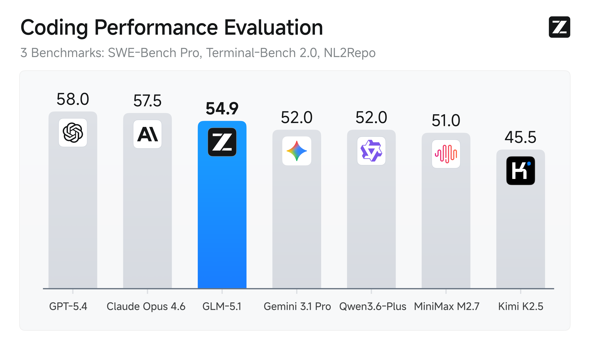

# GLM-5.1 & GLM-5

<div align="center">

</div>
<p align="center">
    👋 加入我们的 <a href="resources/WECHAT.md" target="_blank">微信</a> 或 <a href="https://discord.gg/zFMhpMRFP" target="_blank">Discord</a> 社区。
    <br>
    📖 查看 GLM-5.1 <a href="https://z.ai/blog/glm-5.1" target="_blank">技术博客</a> 和 GLM-5 <a href="https://arxiv.org/abs/2602.15763" target="_blank">技术报告</a>。
    <br>
    📍 在 <a href="https://docs.z.ai/guides/llm/glm-5.1">Z.ai API 平台</a> 使用 GLM-5.1 API 服务。
    <br>
    🔜 GLM-5.1 即将在 <a href="https://chat.z.ai">chat.z.ai</a> 上线。
</p>

## 简介

### GLM-5.1

GLM-5.1 是我们面向智能体工程的新一代旗舰模型，代码能力较前代有显著跃升。在 SWE-Bench Pro 上达到业界领先水平，并在 NL2Repo（仓库级代码生成）和 Terminal-Bench 2.0（真实终端任务）上大幅超越 GLM-5。



但最具意义的突破，不在于单次表现的上限，而在于持续优化的能力。此前的模型——包括 GLM-5——往往很快就"用尽招数"：凭借熟悉的策略快速取得初始收益后便陷入瓶颈，给再多时间也无济于事。

GLM-5.1 则不同。它天生适合在更长的时间跨度上执行智能体任务。我们发现，面对模糊问题，它展现出更优的判断力，并能在长时间会话中保持高效产出——拆解复杂问题、设计实验、解读结果、精准定位瓶颈。通过反复审视自身推理、动态调整策略，GLM-5.1 能够在数百轮迭代、数千次工具调用中持续优化。运行越久，结果越好。

### GLM-5

我们推出了 GLM-5，旨在解决复杂系统工程和长周期智能体任务。扩展（Scaling）仍然是提升通用人工智能（AGI）智能效率的最重要途径之一。与 GLM-4.5 相比，GLM-5 的参数规模从 355B（激活 32B）扩展到 744B（激活 40B），预训练数据量从 23T 增加到 28.5T tokens。GLM-5 还集成了 DeepSeek 稀疏注意力（DSA），在保持长上下文能力的同时大幅降低了部署成本。

强化学习旨在弥合预训练模型中"能力"与"卓越"之间的差距。然而，由于 RL 训练效率低下，在大规模 LLM 上部署强化学习是一项挑战。为此，我们开发了 [slime](https://github.com/THUDM/slime)，一种全新的**异步 RL 基础设施**，大幅提升了训练吞吐量和效率，使更细粒度的后训练迭代成为可能。凭借预训练和后训练两方面的进步，GLM-5 在广泛的学术基准测试上相比 GLM-4.7 取得了显著提升，并在推理、编程和智能体任务上达到了全球开源模型的最佳性能，缩小了与前沿模型的差距。


GLM-5 专为复杂系统工程和长周期智能体任务而设计。在我们的内部评估套件 CC-Bench-V2 上，GLM-5 在前端、后端和长周期任务上均显著超越 GLM-4.7，缩小了与 Claude Opus 4.5 的差距。

在 [Vending Bench 2](https://andonlabs.com/evals/vending-bench-2)（一个衡量长期运营能力的基准测试）上，GLM-5 在开源模型中排名第一。Vending Bench 2 要求模型在一年时间跨度内运营一个模拟自动售货机业务；GLM-5 最终以 4,432 美元的账户余额完成测试，接近 Claude Opus 4.5，展现出强大的长期规划和资源管理能力。

<p align="center">

&nbsp;&nbsp;

</p>
## 下载模型

| 模型        | 下载链接                                                                                                                            | 模型规模   | 精度 |
|-------------|-------------------------------------------------------------------------------------------------------------------------------------|------------|------|
| GLM-5.1     | [🤗 Hugging Face](https://huggingface.co/zai-org/GLM-5.1)<br> [🤖 ModelScope](https://modelscope.cn/models/ZhipuAI/GLM-5.1)         | 744B-A40B  | BF16 |
| GLM-5.1-FP8 | [🤗 Hugging Face](https://huggingface.co/zai-org/GLM-5.1-FP8)<br> [🤖 ModelScope](https://modelscope.cn/models/ZhipuAI/GLM-5.1-FP8) | 744B-A40B  | FP8  |
| GLM-5       | [🤗 Hugging Face](https://huggingface.co/zai-org/GLM-5)<br> [🤖 ModelScope](https://modelscope.cn/models/ZhipuAI/GLM-5)             | 744B-A40B  | BF16 |
| GLM-5-FP8   | [🤗 Hugging Face](https://huggingface.co/zai-org/GLM-5-FP8)<br> [🤖 ModelScope](https://modelscope.cn/models/ZhipuAI/GLM-5-FP8)     | 744B-A40B  | FP8  |

## 本地部署 GLM-5 系列模型

### 准备环境

vLLM、SGLang、xLLM 和 Ktransformers 均支持 GLM-5 系列模型的本地部署, 以下提供简要的部署指南。

+ vLLM

    使用 Docker 部署：
    ```shell
    docker pull vllm/vllm-openai:glm51
    docker pull vllm/vllm-openai:glm51-cu130 # For CUDA 13.0
    ```

+ SGLang

    使用 Docker 部署：
    ```bash
    docker pull lmsysorg/sglang:v0.5.10
    docker pull lmsysorg/sglang:v0.5.10-cu130 # For CUDA 13.0
    ```

### 部署

+ vLLM

    ```shell
    vllm serve zai-org/GLM-5.1-FP8 \
         --tensor-parallel-size 8 \
         --gpu-memory-utilization 0.85 \
         --speculative-config.method mtp \
         --speculative-config.num_speculative_tokens 1 \
         --tool-call-parser glm47 \
         --reasoning-parser glm45 \
         --enable-auto-tool-choice \
         --served-model-name glm-5.1-fp8
    ```
    查看更多详情请参考 [部署指南](https://github.com/vllm-project/recipes/blob/main/GLM/GLM5.md)。

+ SGLang

    ```shell
    SGLANG_ENABLE_SPEC_V2=1 sglang serve \
        --model-path zai-org/GLM-5.1-FP8 \
        --tp-size 8 \
        --tool-call-parser glm47  \
        --reasoning-parser glm45 \
        --speculative-algorithm EAGLE \
        --speculative-num-steps 3 \
        --speculative-eagle-topk 1 \
        --speculative-num-draft-tokens 4 \
        --mem-fraction-static 0.85 \
        --served-model-name glm-5.1-fp8
    ```

    查看更多详情请参考 [SGLang Cookbook](https://cookbook.sglang.io/autoregressive/GLM/GLM-5.1)。

+ xLLM

    请查看[此处的部署指南](https://github.com/zai-org/GLM-5/blob/main/example/ascend.md)。

+ Ktransformers

    请查看[此处的部署指南](https://github.com/kvcache-ai/ktransformers/blob/main/doc/en/kt-kernel/GLM-5.1-Tutorial.md)。

## 引用

如果您在研究中发现 GLM-5 系列模型有帮助，请引用我们的技术报告：

```bibtex
@misc{glm5team2026glm5vibecodingagentic,
      title={GLM-5: from Vibe Coding to Agentic Engineering},
      author={GLM-5-Team and : and Aohan Zeng and Xin Lv and Zhenyu Hou and Zhengxiao Du and Qinkai Zheng and Bin Chen and Da Yin and Chendi Ge and Chenghua Huang and Chengxing Xie and Chenzheng Zhu and Congfeng Yin and Cunxiang Wang and Gengzheng Pan and Hao Zeng and Haoke Zhang and Haoran Wang and Huilong Chen and Jiajie Zhang and Jian Jiao and Jiaqi Guo and Jingsen Wang and Jingzhao Du and Jinzhu Wu and Kedong Wang and Lei Li and Lin Fan and Lucen Zhong and Mingdao Liu and Mingming Zhao and Pengfan Du and Qian Dong and Rui Lu and Shuang-Li and Shulin Cao and Song Liu and Ting Jiang and Xiaodong Chen and Xiaohan Zhang and Xuancheng Huang and Xuezhen Dong and Yabo Xu and Yao Wei and Yifan An and Yilin Niu and Yitong Zhu and Yuanhao Wen and Yukuo Cen and Yushi Bai and Zhongpei Qiao and Zihan Wang and Zikang Wang and Zilin Zhu and Ziqiang Liu and Zixuan Li and Bojie Wang and Bosi Wen and Can Huang and Changpeng Cai and Chao Yu and Chen Li and Chengwei Hu and Chenhui Zhang and Dan Zhang and Daoyan Lin and Dayong Yang and Di Wang and Ding Ai and Erle Zhu and Fangzhou Yi and Feiyu Chen and Guohong Wen and Hailong Sun and Haisha Zhao and Haiyi Hu and Hanchen Zhang and Hanrui Liu and Hanyu Zhang and Hao Peng and Hao Tai and Haobo Zhang and He Liu and Hongwei Wang and Hongxi Yan and Hongyu Ge and Huan Liu and Huanpeng Chu and Jia'ni Zhao and Jiachen Wang and Jiajing Zhao and Jiamin Ren and Jiapeng Wang and Jiaxin Zhang and Jiayi Gui and Jiayue Zhao and Jijie Li and Jing An and Jing Li and Jingwei Yuan and Jinhua Du and Jinxin Liu and Junkai Zhi and Junwen Duan and Kaiyue Zhou and Kangjian Wei and Ke Wang and Keyun Luo and Laiqiang Zhang and Leigang Sha and Liang Xu and Lindong Wu and Lintao Ding and Lu Chen and Minghao Li and Nianyi Lin and Pan Ta and Qiang Zou and Rongjun Song and Ruiqi Yang and Shangqing Tu and Shangtong Yang and Shaoxiang Wu and Shengyan Zhang and Shijie Li and Shuang Li and Shuyi Fan and Wei Qin and Wei Tian and Weining Zhang and Wenbo Yu and Wenjie Liang and Xiang Kuang and Xiangmeng Cheng and Xiangyang Li and Xiaoquan Yan and Xiaowei Hu and Xiaoying Ling and Xing Fan and Xingye Xia and Xinyuan Zhang and Xinze Zhang and Xirui Pan and Xu Zou and Xunkai Zhang and Yadi Liu and Yandong Wu and Yanfu Li and Yidong Wang and Yifan Zhu and Yijun Tan and Yilin Zhou and Yiming Pan and Ying Zhang and Yinpei Su and Yipeng Geng and Yong Yan and Yonglin Tan and Yuean Bi and Yuhan Shen and Yuhao Yang and Yujiang Li and Yunan Liu and Yunqing Wang and Yuntao Li and Yurong Wu and Yutao Zhang and Yuxi Duan and Yuxuan Zhang and Zezhen Liu and Zhengtao Jiang and Zhenhe Yan and Zheyu Zhang and Zhixiang Wei and Zhuo Chen and Zhuoer Feng and Zijun Yao and Ziwei Chai and Ziyuan Wang and Zuzhou Zhang and Bin Xu and Minlie Huang and Hongning Wang and Juanzi Li and Yuxiao Dong and Jie Tang},
      year={2026},
      eprint={2602.15763},
      archivePrefix={arXiv},
      primaryClass={cs.LG},
      url={https://arxiv.org/abs/2602.15763},
}
```
